# 2020东京奥运会奖牌数据分析

2021年8月8日，2020东京奥运会闭幕，中国代表队以38面金牌，32面银牌，18块铜牌，共计88块奖牌的好成绩，取得总排名第二的好成绩。首先恭喜中国代表队，对所有在奥运赛场上拼搏的奥运健儿致敬！

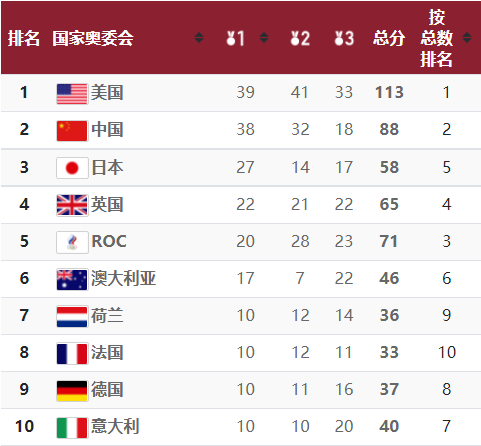

近些年来我国体育竞技水平有了长足的进步，本次东京奥运会成绩仅次于08年北京奥运会（51金21银28铜共100），并好于伦敦奥运会（38金27银23铜共88），位列历史第二。

接下来，从数据的角度开始分析看一下这次奥运会。

首先，从奥运会官网爬取奖牌数据。（https://olympics.com/tokyo-2020/olympic-games/zh/results/all-sports/medalists.htm ）

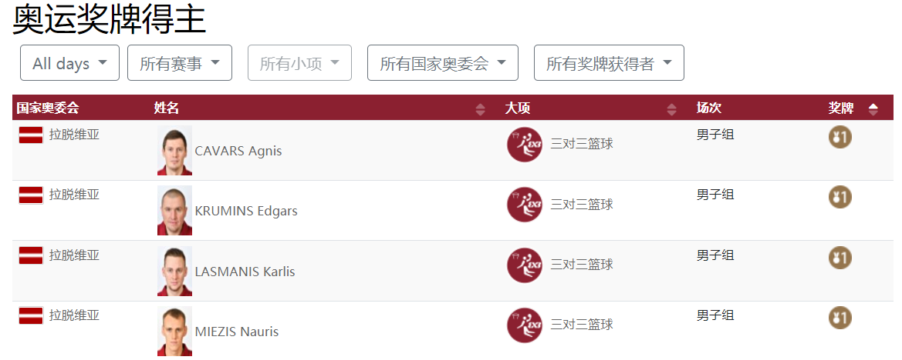
## 总体分析
本次东京奥运会共有204个国家或地区的代表队以及俄罗斯奥运对和奥林匹克难民代表团，共计11669名运动员参赛，其中有2401位运动员获得奖牌。

奥运会共有93个代表队获得了奖牌，只有65个代表队获得过金牌，可见奥运会奖牌的珍贵，也代表着蓝星最强的体育竞技。

通过爬取的奖牌数据我们却看到，颁奖的奖项共计有46个大项，339个小项，在大项上数目和公开资料有些差距（公开数据显示有33个大项目），可能是因为某些大项在统计上单独计算，比如三对三篮球、沙滩排球等。Whatever，下面的都以46个大项目来分析。

接下来我们一下奥运会的项目分布。

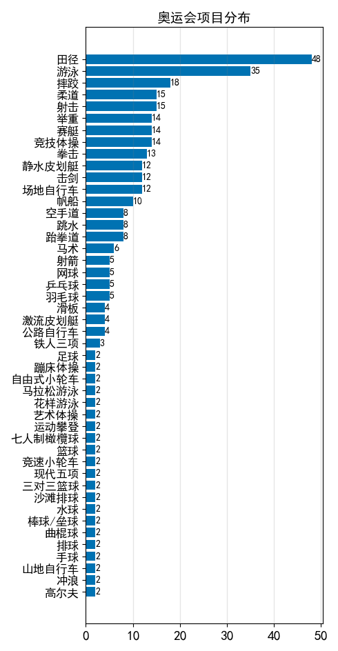

我们可以看到，在奥运会中，田径和游泳分别占了48和35个小项，也是奖牌最大的来源地。

### 中国奖牌分布

接下来，看一下我国的奖牌分布。
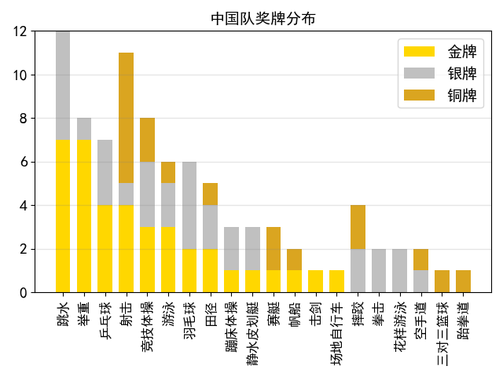

中国对在20个大项获得奖牌，分布在77个小项目上，总计是88枚奖牌。

可以看到咱们国家比较优势的项目，在跳水、举重、乒乓球、射击和体操。尤其在跳水、举重和乒乓球三个项目上，我国竟然没有铜牌。
跳水总共8个项目，我国获得7块金牌，5块银牌，多个项目我国实现了金银牌包揽。
举重总共有14个项目，我国获得7块金牌，1块银牌。
乒乓球自不用说，总共5个项目，只有混双得了银牌，话说当晚看乒乓球混双比赛，大夏天的后半场我看的浑身发冷。
射击总计15个项目，我国共收获11块奖牌。
体操总计14个项目，我国收获8块奖牌。

在奖牌最多的两个大项，田径和游泳，中国游泳获得6块奖牌，中国田径获得5块奖牌。

### 美国奖牌分布
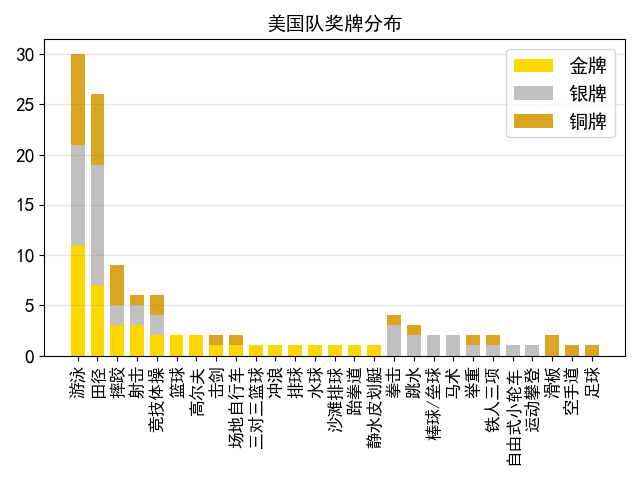
对比一下美国队的成绩，美国在27个大项获得奖牌，分布在102个小项目上，总计113枚奖牌。

美国队的奖牌主要集中于游泳和田径，游泳竟然收获了30块奖牌（11块金牌），田径收获了26块奖牌（7块金牌）。

体操理论上也是美国的优势项目，16年里约奥运会美国体育名将拜尔斯一个人就斩获4枚金牌，今年退赛了。吐槽一句，拜尔斯有多动症，所以一直是持证吃药，身残志坚令人感动，另外美国队很多人都是身残志坚，最多的就是哮喘和多动症，比如飞鱼菲尔普斯就有哮喘，北京奥运会一人独得七块金牌，感动。

还有一些“小项目”美国队也优势比较大，比如篮球、排球、高尔夫等，虽然子项目不多（只分男女子项），但是美国队都很强势。今年美国女排也是过关斩将，打败巴西赢得金牌，取得女排奥运会金牌的突破。

虽然这些“小项目”每一项奖牌不多，但是美国队在这些项目都有优势，所以加起来总数量不少。

### 中美金牌分布对比

最后直观来对比一下中美两国金牌所在项目分布上的差异：
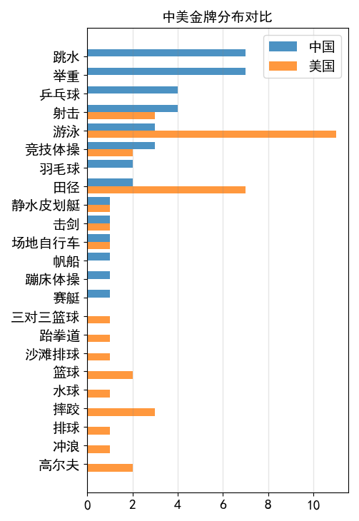

两国金牌上分布差别比较明显，美国队金牌主要分布在田径游泳这样的大项和众多小项上，中国队金牌主要集中在一些技巧项目上的优势比较明显。

## 田径和游泳

### 田径
我们再来看一下奥运会奖牌的最大头，田径和游泳的奖牌都被那些队伍获得。

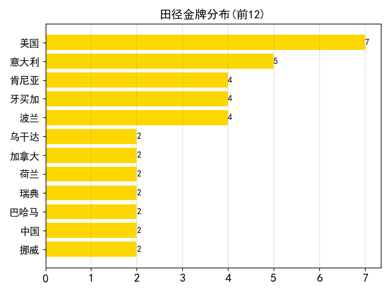 
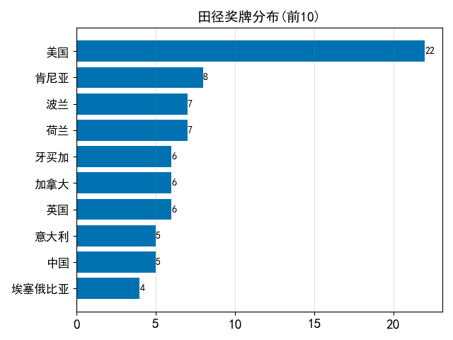

田径方面，美国队有明显优势，7枚金牌夺得第一，放宽到奖牌的维度，美国队更是获得22枚奖牌，一骑绝尘，远超第二名肯尼亚的8枚奖牌。

还值得一说是意大利，今年意大利田径队获得5枚奖牌，全部都是金牌，包括男子100m飞人大战也是意大利选手雅各布斯，以9.80秒摘得桂冠。

我国田径水平在全世界范围来看是靠前，本届奥运会只有12个国家获得田径项目金牌超过两枚，中国则是其中之一。今年女子铅球巩立姣和女子标枪刘诗颖摘得金牌，中国女性棒棒哒！

### 游泳

我们再来看看游泳，是第二大奖牌来源。
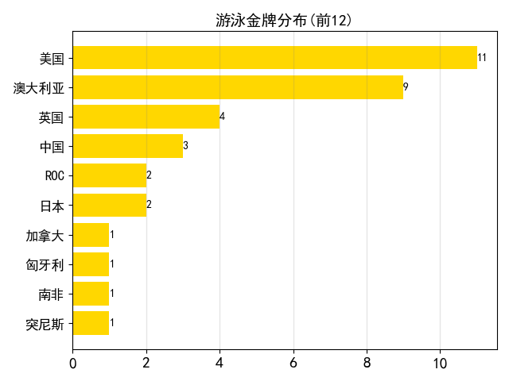
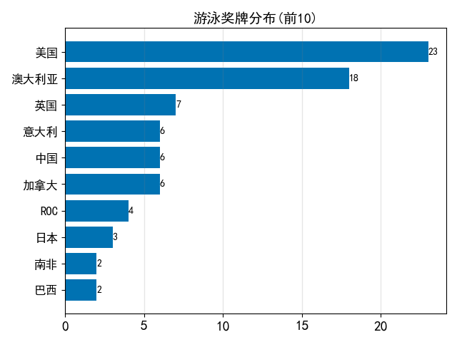

中国队获得金牌2块，总奖牌6块，总体来说全世界范围来看算作是第二梯队，但是仍然和美国和澳大利亚差距比较大。

## 个人排名

- 奖牌

|  国家   | 运动员  | 项目  | 奖牌数量  |
|  ----  | ----  | ----  | ----  |
| 澳大利亚  | 艾玛·麦基翁 | 游泳 | 7 |
| 美国  | 德鲁塞尔 | 游泳 | 5 |
| 澳大利亚  | 凯莉·麦基翁  | 游泳 | 4 |
| 中国  | 张雨霏 | 游泳 | 4 |
| 美国  | 凯蒂·莱德基 | 游泳 | 4 |
| 英国  | 邓肯·斯科特 | 游泳 | 4 |
| 澳大利亚  | 阿里亚妮·蒂特马斯 | 游泳 | 4 |

个人排行榜，前七名全部是游泳运动员（第八名往后获得3块及少于3块），可见游泳项目的奖牌集中度很高，中国游泳运动员张雨霏以4枚奖牌上榜。

- 金牌

|  国家   | 运动员  | 项目  | 金牌数量  |
|  ----  | ----  | ----  | ----  |
| 美国  | 德鲁塞尔 | 游泳 | 5 |
| 澳大利亚  | 艾玛·麦基翁 | 游泳 | 4 |
| 牙买加  | 伊莱恩·汤普森-赫拉  | 田径 | 3 |
| 澳大利亚  | 张雨霏 | 游泳 | 3 |
| 韩国  | 安山 | 射箭 | 3 |
| 新西兰  | CARRINGTON Lisa | 静水皮划艇 | 3 |
| 中国  | 张雨霏 | 游泳 | 2 |
| 中国  | 施廷懋 | 跳水 | 2 |
| 中国  | 谢思埸 | 跳水 | 2 |
| 中国  | 陈梦 | 乒乓球 | 2 |
| 中国  | 马龙 | 乒乓球 | 2 |
| 中国  | 杨倩 | 射击 | 2 |

个人金牌榜，共有6名运动员拿到超过3枚金牌，获得两枚金牌运动员这里只列出了中国运动员。

## 一些个人想法

男子百米飞人，苏炳添在半决赛跑出了9.83秒的亚洲记录，在决赛中也跑进了十秒大关。
在男子百米飞人大战中八个选手，今年最好的成绩就是苏炳添的9秒83，当时在看决赛的时候，真的感觉苏炳添有望夺得奖牌。
虽然最终苏炳添没有夺牌，但是中国人乃至亚洲人站在男子百米的赛场上也是第一次，同样创造了历史。

百米飞人比赛之前的灯光秀，真的令人震撼，之前从来没有关注过百米飞人的灯光秀，因为反正也没有中国队也就自动忽略了。如果没有看今年的飞人大战，强烈建议去网上看一遍，真的看得我汗毛直立。

另外，苏炳添曾在采访谈他的历程，田径队专门请了著名美国田径教练兰迪·亨廷顿，辅以高科技设备来进行针对性训练，从体能到步伐姿势每一个细节来抓。
从前大多数人都会觉得，在需要体能项目上亚洲人没有天赋，苏炳添打破了这种偏见，至少部分打破了偏见。
以9秒83的成绩而言，苏炳添可以在大部分奥运会决赛夺牌（由于前些年博尔特超级天才，夺得金牌的机会很渺茫）。
另外，这次百米飞人决赛，距离苏炳添跑出记录只有三个小时，身体机能、爆发力可能也有所消耗，外加比赛有人抢跑，对苏炳添都是不利的因素。
当然，这也是竞技体育的魅力，诸多偶然都要在电光火石之间决出胜负，胜也荣光，负也荣光。因为，这一刻他们代表的是蓝星的人类极限。

### 田径项目的人种优势？

在现代体育竞技中，我认为训练的作用是大于所谓的人种优势的。

我搜索了一下各大洲的男子百米记录，其实和大家的印象有差别，非洲的记录并不是具有领先优势，不及苏炳添的9.83秒的记录。
我们常常看到的黑人百米冠军往往不是来自非洲，博尔特虽然是黑人，但是他是牙买加人，牙买加在加勒比海，也就是在北美地区。(欧洲记录应该更新为这次意大利选手的9秒80)

- 北美洲记录(世界纪录)：9.58s
- 亚洲记录：9.83s
- 欧洲记录：9.84s
- 非洲记录：9.85s
- 大洋洲记录：9.93s
- 南美洲记录：10.01s

我相信在田径项目中，通过科学合理的训练，是一定能提高成绩极限。
当然，我不否定天才，不否认天赋在竞技体育的作用，比如博尔特，天选之子，他就是跑的比所有人都快。美国田径的强势和科学的训练是离不开，我们在这一方面应该像美国学习。

### 请务必多吃肉蛋奶

再说一下中国人的营养问题，中国人的饮食结构里碳水化合物占得比例过高，蛋白质的占比很少，肉蛋奶肯定是要比米面要贵得多，毕竟中国人开始吃饱饭，也就是40年。
**蛋白质是我们身体合成肌肉、性激素、免疫细胞等不可或缺的物质，长期摄入不足必然会影响身体健康，而蛋白质最佳摄入方式便是肉蛋奶**（而不是一些保健品）。
随着我们经济的发展，我们的饮食应当更多的摄入吃肉蛋奶，来增强体质。钟南山教授就说过自己从年轻的时候就每天喝牛奶，张文宏教授也推荐多吃肉蛋奶。
当然，合理膳食指的是膳食比例的调节，现在有很多人完全戒除碳水，是不对的，尤其是女孩子，不摄入碳水会影响激素水平，影响生理周期。

最近从外国刮来“素食运动”，包括“中国人多吃一块肉，亚马逊就少一片热带雨林”，“植物肉”等等，别信这些扯淡的话。
欧美人每天牛排、牛奶吃着，轮到中国人就不许吃了？典型的强盗逻辑。中国人自古就有人吃素，比如和尚。
中国人的文化是，外圆内方，约束自己，尊重他人习惯。你可以不吃肉，但不要站在道德的高地来指责中国人吃肉。
更何况，欧美的人均消费量要远高于我们，要减让他们先到我们的水平再说。

植物肉，现阶段我认为更偏向于是一种营销产品，这个东西在营养价值上是否能替代真的肉还得长时间看。千万不要被人忽悠瘸了，再也不吃肉了，真的把这个当肉吃。

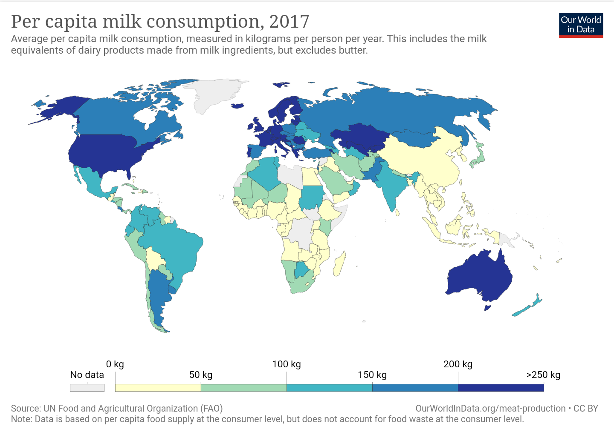

多吃肉蛋奶，祝大家变得更强！
